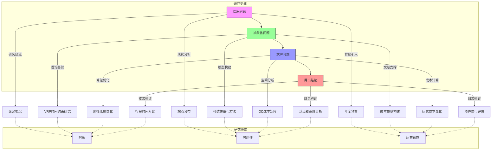

```mermaid
graph TD
    subgraph 纵轴[研究步骤]
        A[提出问题] --> B[抽象化问题]
        B --> C[求解问题]
        C --> D[得出结论]
    end

    subgraph 横轴[研究线索]
        X[时长] 
        Y[可达性]
        Z[运营预算]
    end

    A -->|研究区域| X1[交通概况]
    A -->|现状分析| Y1[站点分布]
    A -->|背景引入| Z1[年度预算]
    
    B -->|理论基础| X2[VRP时间约束研究]
    B -->|模型构建| Y2[可达性量化方法]
    B -->|文献支撑| Z2[成本模型构建]
    
    C -->|算法优化| X3[路径长度优化]
    C -->|空间分析| Y3[OD成本矩阵]
    C -->|成本计算| Z3[运营成本显化]
    
    D -->|效果验证| X4[行程时间对比]
    D -->|效果验证| Y4[热点覆盖度分析]
    D -->|效果验证| Z4[预算优化评估]

    style A fill:#f9f,stroke:#333
    style B fill:#9f9,stroke:#333
    style C fill:#99f,stroke:#333
    style D fill:#f99,stroke:#333
    
    X1 -.-> X
    Y1 -.-> Y
    Z1 -.-> Z
    
    X2 -.-> X
    Y2 -.-> Y
    Z2 -.-> Z
    
    X3 -.-> X
    Y3 -.-> Y
    Z3 -.-> Z
    
    X4 -.-> X
    Y4 -.-> Y
    Z4 -.-> Z
```