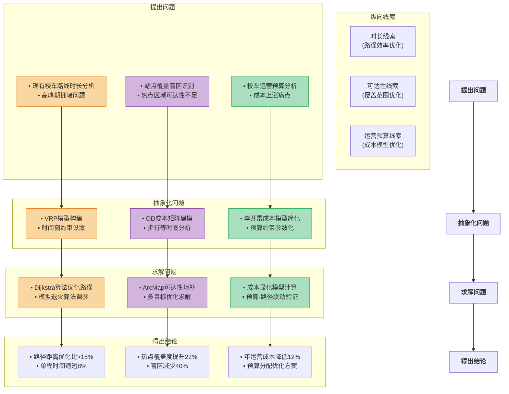

```mermaid
graph TD
    %% 定义横向轴（研究步骤）
    A[提出问题] --> B[抽象化问题]
    B --> C[求解问题]
    C --> D[得出结论]

    %% 定义纵向轴（研究线索）
    subgraph 纵向线索
        时长["时长线索<br>(路径效率优化)"]
        可达性["可达性线索<br>(覆盖范围优化)"]
        预算["运营预算线索<br>(成本模型优化)"]
    end

    %% 关联各步骤与线索
    subgraph 提出问题
        A1["• 现有校车路线时长分析<br>• 高峰期拥堵问题"]
        A2["• 站点覆盖盲区识别<br>• 热点区域可达性不足"]
        A3["• 校车运营预算分析<br>• 成本上涨痛点"]
    end
    A1:::时长 --> B1
    A2:::可达性 --> B2
    A3:::预算 --> B3

    subgraph 抽象化问题
        B1["• VRP模型构建<br>• 时间窗约束设置"]
        B2["• OD成本矩阵建模<br>• 步行等时圈分析"]
        B3["• 李开雷成本模型简化<br>• 预算约束参数化"]
    end
    B1:::时长 --> C1
    B2:::可达性 --> C2
    B3:::预算 --> C3

    subgraph 求解问题
        C1["• Dijkstra算法优化路径<br>• 模拟退火算法调参"]
        C2["• ArcMap可达性填补<br>• 多目标优化求解"]
        C3["• 成本显化模型计算<br>• 预算-路径联动验证"]
    end
    C1:::时长 --> D1
    C2:::可达性 --> D2
    C3:::预算 --> D3

    subgraph 得出结论
        D1["• 路径距离优化比>15%<br>• 单程时间缩短8%"]
        D2["• 热点覆盖度提升22%<br>• 盲区减少40%"]
        D3["• 年运营成本降低12%<br>• 预算分配优化方案"]
    end

    %% 样式定义
    classDef 时长 fill:#FAD7A0,stroke:#E67E22;
    classDef 可达性 fill:#D2B4DE,stroke:#8E44AD;
    classDef 预算 fill:#A9DFBF,stroke:#27AE60;
    classDef axis font-size:16px,font-weight:bold;

    class A,B,C,D axis;
```